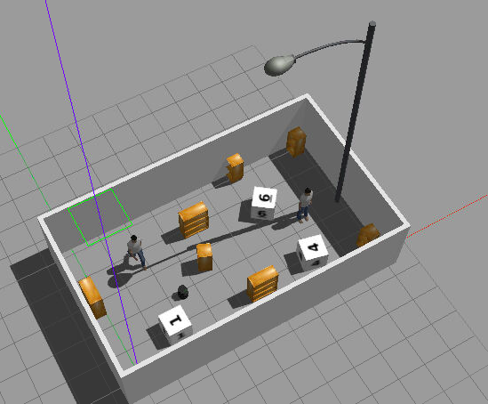
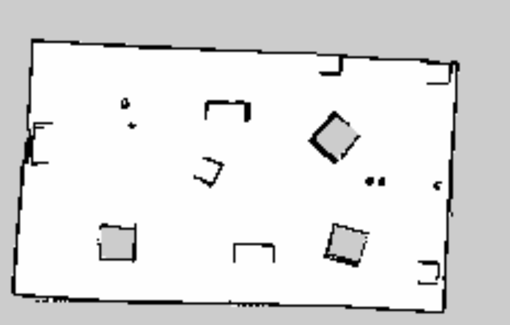
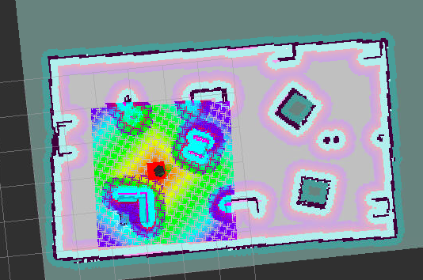

# Udacity Robotic Software NanoDegree Final Project
## Home Service Robot

### Introduction
The goal of this project is to program a robot that can autonomously map an environment and navigate to pick and drop virtual objects.The tasks involved in the project are as follows:

* Design and build simple simulation world with Gazebo Building Editor
* Genereate the map of the environement by using gmapping SLAM package
* Use the ROS navigation stack and command the robot to go to different desired positions using 2D Nav Goal
* create C++ node named 'pick_objects' that drives the robot to specified pickup and dropoff zones
* create  C++ node name add_markers that keeps track of robot pose by subscribing to robot odometry and publishes markers to rviz at specific locations. 
* estabilish a communication between pickup node and add_marker node to compelte require Home Service Robot implementation.

### Motivation
To consolidate the robotic concepts learned in the Udacity Robotics Nanodegree and get a hands-on experience of working with _C++, ROS, Gazebo simulation enviroment_. To be specific, it is mainly test and improve _ROS_ abilities and skills to setting and fine tune parameters,communicating between different nodes of different packages, creating C++ nodes, publising and subscribing to different topics and writing launch files.

 
      
### Prerequisites and Dependencies

#### 1.Install Gazebo>=7.0 and ROS kinetic in Linux.

#### 2. Cmake>=3.0 , gcc/g++>=5.4 and xterm

#### 3. following ros packages are used for this project and process of installing them are detailed below
  1. [gmapping](http://wiki.ros.org/gmapping)
  The gmapping package provides laser-based slam, as a ROS node called slam_gmapping. slam_gmapping is used to create 2-D occupancy grid map of the environment from laser and pose data collected by mobile robot. In this project,it is used to generate map of the simulated Gazebo world.With the gmapping_demo.launch file, you can easily perform SLAM and build a map of the environment with a robot equipped with laser range finder sensors or RGB-D cameras.
  2. [turtlebot_teleop](http://wiki.ros.org/turtlebot_teleop)
   With the keyboard_teleop.launch file, you can manually control a robot using keyboard commands.
  3. [turtlebot_rviz_launchers](http://wiki.ros.org/turtlebot_rviz_launchers)
  With the view_navigation.launch file, you can load a preconfigured rviz workspace. You’ll save a lot of time by launching this file, because it will automatically load the robot model, trajectories, and map for you.
  4. [turtlebot_gazebo](http://wiki.ros.org/turtlebot_gazebo)
  With the turtlebot_world.launch you can deploy a turtlebot in a gazebo environment by linking the world file to it.
   
        

### Build and Run the project

#### 1.Clone and Intialize the catkin workspace.
    
    
       $ mkdir -p catkin_ws/src
       $ cd catkin_ws/
       $ cd catkin_ws/src
       $ catkin_init_workspace
       $ git clone https://github.com/RamCharanThota/Udacity_RND_HomeServiceRobot.git
        
    
#### 2. Build the packages.
     
     
     $ cd ../
     $ catkin_make
     $ source devel/setup.bash

#### 3. Run and launch HomeService robot
     $ cd catkin_ws/src/scripts/
     $ chmod +x ./home_service.sh
     $ ./home_service.sh
     
#### Results

     
     
 

